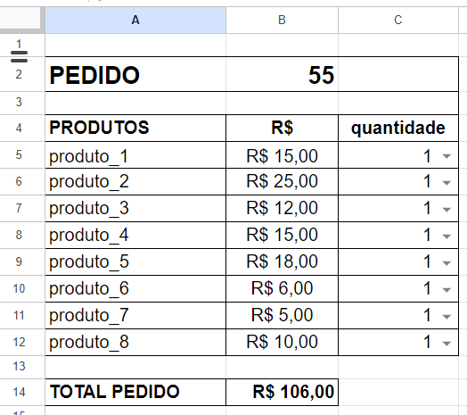

# Frente de Caixa - Nami Street Food

Minha esposa é trabalha com feiras e sempre utilizamos planilhas para fazer o controle de pedidos, porém, atualmente, precisamos de mais agilidade por conta do aumento de fluxo de pessoas. Isso me motivou a fazer um projeto de Frente de Caixa simples, desenvolvido como uma aplicação web usando Python e Flask. O objetivo do projeto é demonstrar como implementar um sistema de controle de pedidos e produtos com base em uma planilha que utilizavámos nas feiras.



## Descrição

Este projeto simula um sistema de frente de caixa onde é possível visualizar e atualizar pedidos e quantidades de produtos. A aplicação permite:

- Exibir detalhes de um pedido, incluindo produtos, preços e quantidades.
- Alterar a quantidade dos produtos e visualizar a atualização do total do pedido em tempo real.
- Deixar o número do pedido dinâmico
- Imprimir o pedido com os detalhes atualizados.

## Tecnologias Utilizadas

- **Backend**: [Flask](https://flask.palletsprojects.com/) (framework web em Python)
- **Frontend**: HTML, CSS, JavaScript
- **Controle de Versão**: Git

## Estrutura do Projeto

- `app.py`: O arquivo principal que define a aplicação Flask, processa os dados e renderiza o template HTML.
- `templates/pedido.html`: O template HTML que exibe os detalhes do pedido e inclui um formulário para atualizar as quantidades dos produtos.

## Como Executar

1. **Clone o Repositório**

  Clone o repositório para o seu ambiente local:
  ```bash
  git clone https://github.com/paulosandim/feiras-nami
  cd feiras-nami

2. **Instale as Dependências**

  Certifique-se de ter o Flask instalado. Você pode instalar as dependências com:
  ```bash
  pip install flask

3. **Instale as Dependências**

  No terminal, execute o seguinte comando para iniciar o servidor Flask:
  ```bash
  python app.py
